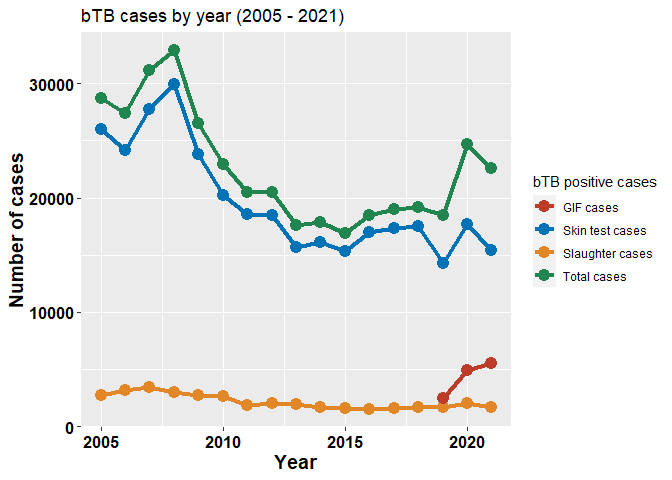
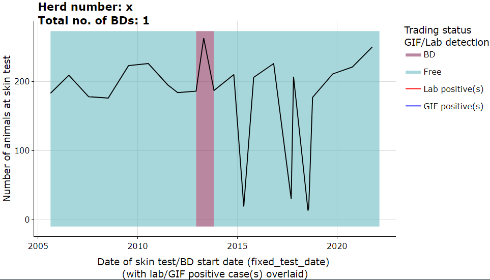

<!-- README.md is generated from README.Rmd. Please edit that file -->

# cvera

<!-- badges: start -->
<!-- badges: end -->

------------------------------------------------------------------------

`cvera` is an R package with a collection of utility R functions, useful
in exploring Irish bTB datasets collated in CVERA.

------------------------------------------------------------------------

## Installation

You can install the development version of cvera from
[GitHub](https://github.com/) with:

``` r
# install.packages("devtools")
devtools::install_github("044mj/cvera")
```

## Example

Extract yearly summary data and visualisations of reactor numbers from
`master_tb` dataset.

Read in data:

``` r
library(tidyverse)
# if using readr::read_csv() they use first 1000 rows to guess type. 
# If the first 1,000 are missing, it will default to logical. GIF variables are missing in the first 1000
#because it only came in during May 2019 so include col_types for these variables:
master_tb <- read_csv("N:/data/tb/master_tb_data_jamie_m/year_2022/master_tb_24_Mar_2022.csv", 
                          col_types = cols(.default = "?", 
                                           gif8d_actual_date = col_date(), 
                                           gif_cases = col_number()))
```

Using `all_cases_per_year` from `cvera` package:

``` r
library(cvera)
#drop 2022 figures as we only have 3 months worth of data
cases <- all_cases_per_year(master_tb, drop_years = c(2022))
```

results in

    #> [[1]]
    #> # A tibble: 17 x 5
    #>     year skin_test_reactors slaughter_detected gif_cases all_cases
    #>    <int>              <dbl>              <int>     <int>     <dbl>
    #>  1  2005              25975               2709        NA     28684
    #>  2  2006              24159               3215        NA     27374
    #>  3  2007              27735               3421        NA     31156
    #>  4  2008              29901               3003        NA     32904
    #>  5  2009              23820               2714        NA     26534
    #>  6  2010              20218               2680        NA     22898
    #>  7  2011              18557               1905        NA     20462
    #>  8  2012              18499               2015        NA     20514
    #>  9  2013              15680               1962        NA     17642
    #> 10  2014              16139               1709        NA     17848
    #> 11  2015              15364               1583        NA     16947
    #> 12  2016              16967               1516        NA     18483
    #> 13  2017              17336               1628        NA     18964
    #> 14  2018              17548               1657        NA     19205
    #> 15  2019              14323               1671      2456     18450
    #> 16  2020              17685               2048      4920     24653
    #> 17  2021              15401               1706      5527     22634
    #> 
    #> [[2]]
    #> Warning: Removed 14 row(s) containing missing values (geom_path).
    #> Warning: Removed 14 rows containing missing values (geom_point).



## Interactive herd plot:

``` r
p <- herd_plot(master_tb, "x1234567") #fake herd
p
```


